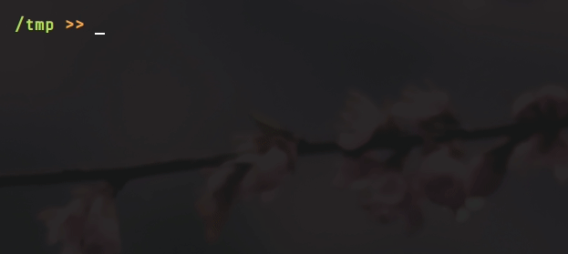

**NOTE: This project is archived. A good alternative is [goto](https://github.com/iridakos/goto).**

## shellcuts - directory shortcuts for your shell


Shellcuts allows you to jump between saved locations in your filesystem via a single, short command. Shellcuts can:

- create a named shellcut for any location in your filesystem
- add a follow-up command to any shellcut (like `ls` or `clear`)
- save a temporary "bread crumb" shellcut
- delete any shellcut by name
- list all available shellcuts



## installation
If you use a Debian-based system (Debian/Ubuntu/Linux Mint/etc) with an amd64/x86-64 CPU architecture (almost all modern consumer computers), then you can download and install `shellcuts` with these commands:
```sh
wget https://github.com/tgsachse/shellcuts/releases/latest/download/shellcuts.deb
dpkg -i shellcuts.deb
```
Other architectures have not been validated. This software hasn't been packaged for other Linux or MacOS flavors yet. The next release (v1.5.0) will add support for other operating systems and architectures.

usage
-----
Please see the `man` page for usage instructions:
```sh
  man sc
```
